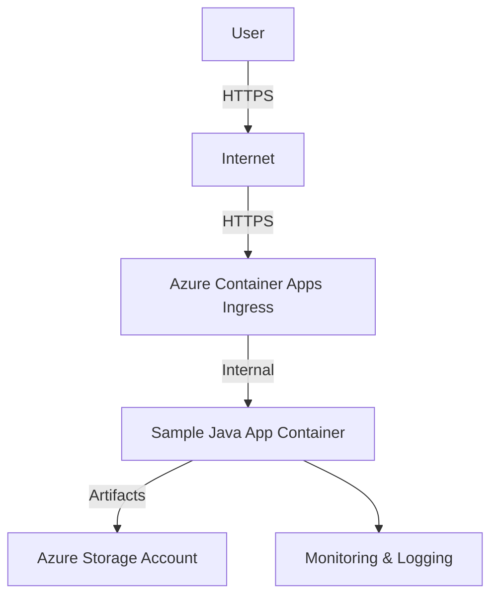

```markdown
# Sample Java Project Deployment

## Overview

This document provides release notes and deployment details for the **Sample Java Project**. The application is a Java-based service, built and deployed using modern CI/CD practices, and hosted on Azure Container Apps in the North Europe region.

- **Repository:** [https://github.com/prabhum10/sample-java-project.git](https://github.com/prabhum10/sample-java-project.git)
- **Latest Build ID:** `74f2720e`
- **Deployment URL:** [https://swifttiger649-app--e58mf7q.thankfulpebble-3a092a89.northeurope.azurecontainerapps.io](https://swifttiger649-app--e58mf7q.thankfulpebble-3a092a89.northeurope.azurecontainerapps.io)
- **Azure Resource Group:** `ai-mcp-http-rg01`
- **Azure Region:** North Europe

---

## Objective

- Automate build, test, and deployment processes for consistent, reliable releases.
- Ensure secure handling of secrets and configurations.
- Maintain high code quality through automated testing and vulnerability scanning.
- Provide cost transparency and operational visibility.

---

## Application Build & Deployment Details

### 1. Branching & Source Control

- **Branch Naming:** Follows conventions such as `feature/login`, `bugfix/auth-issue` for clarity and traceability.
- **Repository:** [sample-java-project](https://github.com/prabhum10/sample-java-project.git)

### 2. CI/CD Pipeline

- **Automation:** Implemented via GitHub Actions or Jenkins.
- **Pipeline Steps:**
  - Checkout code on every push or pull request.
  - Run automated unit and integration tests.
  - Build Java artifacts (`build/libs/*.jar`).
  - Store build artifacts in a secure, versioned repository (e.g., GitHub Packages).
  - Scan for vulnerabilities and misconfigurations.
  - Deploy to staging, then production using blue-green/canary deployment patterns for zero downtime.

### 3. Configuration & Secrets Management

- **Environment-specific configuration files** are used.
- **Secrets** are managed via GitHub Secrets or HashiCorp Vault—no hardcoded sensitive data.

### 4. Deployment

- **Platform:** Azure Container Apps
- **Resource:** `swifttiger649-app`
- **Environment:** `swifttiger649-env`
- **Status:** Running
- **FQDN:** [swifttiger649-app--e58mf7q.thankfulpebble-3a092a89.northeurope.azurecontainerapps.io](https://swifttiger649-app--e58mf7q.thankfulpebble-3a092a89.northeurope.azurecontainerapps.io)
- **Outbound IP:** `20.93.56.173`

### 5. Monitoring

- **Tools:** Prometheus, Grafana, or New Relic (as applicable) for deployment and application health monitoring.

---

## Security Scan Summary

- **Scan Types:** Vulnerabilities, Misconfigurations, Secrets, License compliance
- **Severity Levels Checked:** CRITICAL, HIGH, MEDIUM, LOW, UNKNOWN
- **Tooling:** Automated scans on every build (e.g., Dependabot, OWASP Dependency-Check)
- **Target:** [sample-java-project](https://github.com/prabhum10/sample-java-project)
- **Batch ID:** `fe31fcc0-5c41-46f4-8beb-b1411504f5a0`
- **Findings:** Refer to the security scan report for detailed findings and remediation steps.

---

## Cost Estimate

| Resource            | SKU/Type | Monthly Cost (USD) |
|---------------------|----------|--------------------|
| Web App             | B1       | $9.71              |
| App Service Plan    | B1       | $9.71              |
| Storage Account     | LRS/100GB| $2.08              |
| Container Apps      | 10,000 runs | $5.00           |
| **Total**           |          | **$26.50**         |

> **Note:** Prices are based on live Azure Retail Prices API where possible; static rates used as fallback.

---

## High-Level Network Diagram



---

## Additional Notes

- **Deployment Permissions:** Restricted to trusted users with role-based access control.
- **Dependency Management:** Dependencies are regularly updated and scanned.
- **Documentation:** Build and deployment steps are documented for team consistency.

---

## References

- [Sample Java Project Repository](https://github.com/prabhum10/sample-java-project.git)
- [Azure Container Apps Documentation](https://learn.microsoft.com/en-us/azure/container-apps/)
```
