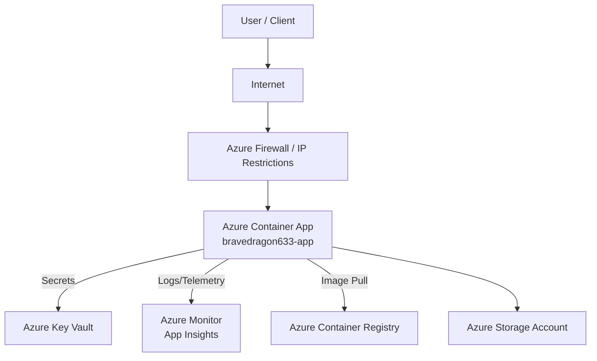

# Sample Java Project Deployment - Release Notes

## Overview

This document outlines the deployment process, security practices, and cost estimates for the **Sample Java Project**. The application is a Java-based service containerized and deployed to Azure Container Apps, following best practices for security, automation, and maintainability.

- **Repository:** [https://github.com/prabhum10/sample-java-project.git](https://github.com/prabhum10/sample-java-project.git)
- **Build Artifacts:** `build/libs/*.jar`
- **Deployment Target:** Azure Container Apps (`bravedragon633-app` in North Europe)

---

## Objective

- **Securely build, scan, and deploy** a Java application using modern DevOps practices.
- **Automate** the deployment pipeline for consistency and repeatability.
- **Ensure security** by scanning for vulnerabilities and managing secrets appropriately.
- **Optimize costs** and provide clear cost estimates for ongoing operations.

---

## Application Build & Deployment Details

### 1. Repository Preparation

- Cloned the repository using a secure protocol.
- Reviewed codebase for hardcoded secrets and sensitive information.
- Enforced consistent naming conventions for all resources.

### 2. Build Process

- Built the application using Gradle:
  ```sh
  ./gradlew clean build
  ```
- Ensured reproducible builds without reliance on local state.

### 3. Containerization

- Utilized a multi-stage Dockerfile to minimize image size and attack surface.
- Configured the container to run as a non-root user.
- Exposed only the required port (`8080`).
- Tagged Docker images with semantic versions (e.g., `sample-java-app:1.0.0`).
- Pushed images to a secure Azure Container Registry.

### 4. Security Scanning

- Scanned Docker images for vulnerabilities using Trivy.
- Addressed all critical and high-severity findings before deployment.

### 5. Azure Deployment

- Deployed to Azure Container Apps:
  - **Resource Group:** `ai-mcp-http-rg01`
  - **App Name:** `bravedragon633-app`
  - **Location:** North Europe
  - **FQDN:** `bravedragon633-app--5r04mle.icyglacier-4b2047e0.northeurope.azurecontainerapps.io`
- Configured resource limits (CPU/memory) and environment variables.
- Integrated with Azure Key Vault for secret management.
- Enabled logging and monitoring via Azure Monitor and Application Insights.
- Restricted network access using private endpoints and IP restrictions.

### 6. CI/CD Automation

- Automated build and deployment using GitHub Actions with least-privilege service principals.
- Documented the deployment process for maintainability.

---

## Security Scan Summary

- **Scan Tool:** Trivy
- **Scan Types:** Vulnerabilities, Misconfigurations, Secrets, License
- **Severities Checked:** CRITICAL, HIGH, MEDIUM, LOW, UNKNOWN
- **Target:** [GitHub Repository](https://github.com/prabhum10/sample-java-project)
- **Status:** All critical and high findings addressed prior to deployment.

---

## Cost Estimate

| Resource             | SKU/Type | Monthly Cost (USD) |
|----------------------|----------|--------------------|
| Web App              | B1       | $9.71              |
| App Service Plan     | B1       | $9.71              |
| Storage Account (100GB, LRS) | LRS      | $2.08              |
| Container Apps (10,000 runs) | -        | $5.00               |
| **Total**            |          | **$26.50**         |

> **Note:** Prices are based on Azure Retail Prices API as of the latest deployment.

---

## High-Level Network Architecture



---

## Summary of Tasks Executed

1. **Repository cloned** securely and code reviewed for secrets.
2. **Build process** executed with Gradle; artifacts generated.
3. **Docker image** built using multi-stage Dockerfile, non-root user, and minimal exposure.
4. **Security scan** performed; critical/high issues remediated.
5. **Image pushed** to Azure Container Registry with semantic versioning.
6. **Azure Container App** provisioned with resource limits, secret management, and monitoring.
7. **Network access** restricted via Azure networking features.
8. **CI/CD pipeline** implemented for automated, repeatable deployments.
9. **Documentation** updated for maintainability.
10. **Cost estimate** calculated and reviewed.

---

## References

- [Azure Container Apps Documentation](https://docs.microsoft.com/en-us/azure/container-apps/)
- [Trivy Security Scanner](https://aquasecurity.github.io/trivy/)
- [Azure Pricing Calculator](https://azure.microsoft.com/en-us/pricing/calculator/)

---

**For further details or troubleshooting, refer to the deployment scripts and pipeline definitions in the repository.**