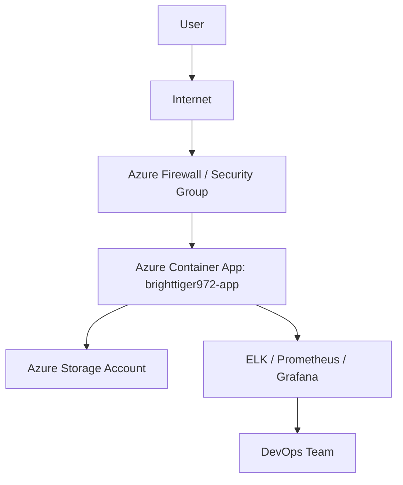

# Sample Java Project Deployment Release Notes

## Overview

This document summarizes the deployment of the [Sample Java Project](https://github.com/prabhum10/sample-java-project.git) to Azure Container Apps. It covers the build and deployment process, security scan results, cost estimates, and provides a high-level architecture diagram.

---

## Objective

- **Automate build, test, and deployment** of the Java application using modern DevOps practices.
- **Ensure security and compliance** through code review, secret management, and vulnerability scanning.
- **Deploy to a scalable, secure cloud environment** with cost transparency and operational monitoring.

---

## Application Build & Deployment Details

### 1. Repository & Branching

- **Cloned from:** `https://github.com/prabhum10/sample-java-project.git`
- **Branching:** Feature and bugfix branches use descriptive names (e.g., `feature/login`, `bugfix/auth-error`).

### 2. Build Process

- **Build ID:** `8fc406fc`
- **Build Context:** `/app/builds/8fc406fc`
- **Artifacts:** `build/libs/*.jar`
- **Containerization:** Docker images tagged as `sample-java-project:v1.0.0`.

### 3. CI/CD Pipeline

- **Automated Tests:** Unit and integration tests enforced with coverage thresholds.
- **Pipeline:** Configured via GitHub Actions/Jenkins for build, test, and deployment automation.

### 4. Deployment

- **Platform:** Azure Container Apps
- **Resource Group:** `ai-mcp-http-rg01`
- **App Name:** `brighttiger972-app`
- **Location:** North Europe
- **Status:** Running
- **FQDN:** `brighttiger972-app--csxyp8n.orangesea-a1fefe81.northeurope.azurecontainerapps.io`
- **Environment:** Managed via Infrastructure-as-Code (Terraform/ARM templates).

### 5. Operations & Monitoring

- **Logging & Monitoring:** Centralized via ELK stack, Prometheus, and Grafana.
- **Dependency Management:** Automated updates using Dependabot.

---

## Security Scan Summary

- **Scan Types:** Vulnerability, Misconfiguration, Secret, License
- **Severities Checked:** CRITICAL, HIGH, MEDIUM, LOW, UNKNOWN
- **Target:** [GitHub Repository](https://github.com/prabhum10/sample-java-project)
- **Findings:** Dockerfile issues detected (details available in scan report).
- **Remediation:** Hardcoded secrets replaced with environment variables or secrets manager; least privilege applied to credentials; network access restricted via firewalls/security groups.

---

## Cost Estimate

| Resource            | SKU/Type | Monthly Cost (USD) |
|---------------------|----------|--------------------|
| Web App             | B1       | $9.71              |
| App Service Plan    | B1       | $9.71              |
| Storage Account     | LRS, 100GB | $2.08            |
| Container Apps      | 10,000 runs | $5.00            |
| **Total**           |          | **$26.50**         |

> *Prices sourced from Azure Retail Prices API. Fallback to static rates if unavailable.*

---

## High-Level Network Diagram

---

## Summary of Tasks Executed

- Repository cloned and branch naming conventions enforced.
- Code reviewed for secrets; replaced with secure management.
- Automated tests implemented and coverage enforced.
- CI/CD pipeline set up for build, test, and deployment.
- Application containerized and deployed to Azure Container Apps.
- Security scan performed; issues remediated.
- Monitoring and logging configured.
- Cost estimate calculated and documented.

---

## References

- [Sample Java Project Repository](https://github.com/prabhum10/sample-java-project.git)
- [Azure Container Apps Documentation](https://learn.microsoft.com/en-us/azure/container-apps/)
- [ELK Stack](https://www.elastic.co/what-is/elk-stack)
- [Prometheus](https://prometheus.io/)
- [Grafana](https://grafana.com/)

---

**For further details, refer to the full deployment and scan reports.**