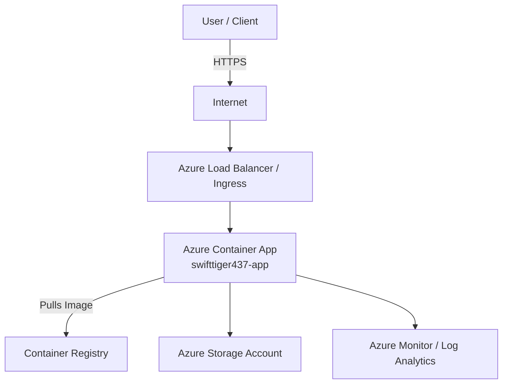

# Sample Java Project Deployment

## Overview

This document outlines the deployment process, architecture, and operational details for the [Sample Java Project](https://github.com/prabhum10/sample-java-project). The application is a Java-based service, containerized and deployed to Azure Container Apps in the North Europe region. This README covers build, deployment, security, and cost considerations.

---

## Objective

- **Automate** the build and deployment of a Java application using modern DevOps practices.
- **Containerize** the application for portability and consistency.
- **Deploy** securely to Azure Container Apps with best practices for configuration, monitoring, and cost efficiency.
- **Ensure** compliance with security standards via automated scanning.

---

## Application Build & Deployment Details

### 1. Repository & Source

- **Repository:** [https://github.com/prabhum10/sample-java-project](https://github.com/prabhum10/sample-java-project)
- **Build ID:** `dcbca712`
- **Build Artifacts:** `build/libs/*.jar`

### 2. Build Process

- **Clone Repository:**
  ```sh
  git clone https://github.com/prabhum10/sample-java-project
  ```
- **Build with Maven:**
  ```sh
  mvn clean package
  ```
  - Ensures Java and Maven are installed and up-to-date.
  - Output: JAR file in `target/` directory.

### 3. Containerization

- **Dockerfile Example:**
  ```dockerfile
  FROM openjdk:17-jdk-alpine
  COPY target/*.jar app.jar
  ENTRYPOINT ["java", "-jar", "/app.jar"]
  ```
- **Build Docker Image:**
  ```sh
  docker build -t <registry>/sample-java-project:<tag> .
  ```
- **Push to Registry:**
  - Use a secure registry (Docker Hub, AWS ECR, GCP Artifact Registry, or Azure Container Registry).

### 4. Deployment

- **Platform:** Azure Container Apps
- **Resource Group:** `ai-mcp-http-rg01`
- **App Name:** `swifttiger437-app`
- **Region:** North Europe
- **FQDN:** `https://swifttiger437-app--pr6r6sf.jollypond-2affef1e.northeurope.azurecontainerapps.io`
- **Status:** Running

- **Deployment Steps:**
  1. Deploy container image to Azure Container Apps.
  2. Configure environment variables for secrets and runtime configuration.
  3. Apply least privilege IAM roles and enable HTTPS.
  4. Set up monitoring and logging (Azure Monitor, Log Analytics).

- **Automation:**
  - Use CI/CD pipelines (e.g., GitHub Actions, Jenkins) for repeatable builds and deployments.

---

## Security Scan Summary

- **Scan Tool:** Automated (vuln, misconfig, secret, license)
- **Target:** [https://github.com/prabhum10/sample-java-project](https://github.com/prabhum10/sample-java-project)
- **Findings:** 1 Dockerfile finding (severity details not shown here)
- **Best Practices:**
  - Regularly scan for vulnerabilities and misconfigurations.
  - Keep dependencies and base images up-to-date.
  - Use environment variables for secrets, not hardcoded values.
  - Enforce HTTPS and secure access policies.

---

## Cost Estimate

| Resource             | SKU/Type | Monthly Cost (USD) |
|----------------------|----------|--------------------|
| Web App              | B1       | $9.71              |
| App Service Plan     | B1       | $9.71              |
| Storage Account (100GB, LRS) | LRS      | $2.08              |
| Container Apps (10,000 runs) | -        | $5.00              |
| **Total**            |          | **$26.50**         |

> _Live prices fetched from Azure Retail Prices API where possible. Fallback to static rates if not found._

---

## High-Level Network Diagram



---

## Additional Notes

- **Resource Naming:** Use clear, environment-specific names (e.g., `sample-java-project-prod`).
- **Versioning:** Tag Docker images and deployments for traceability.
- **Monitoring:** Enable Azure Monitor and Log Analytics for observability.
- **CI/CD:** Automate build and deployment to reduce manual errors and ensure consistency.

---

## References

- [Azure Container Apps Documentation](https://learn.microsoft.com/en-us/azure/container-apps/)
- [Maven Documentation](https://maven.apache.org/guides/)
- [Docker Best Practices](https://docs.docker.com/develop/dev-best-practices/)

---

**End of README**