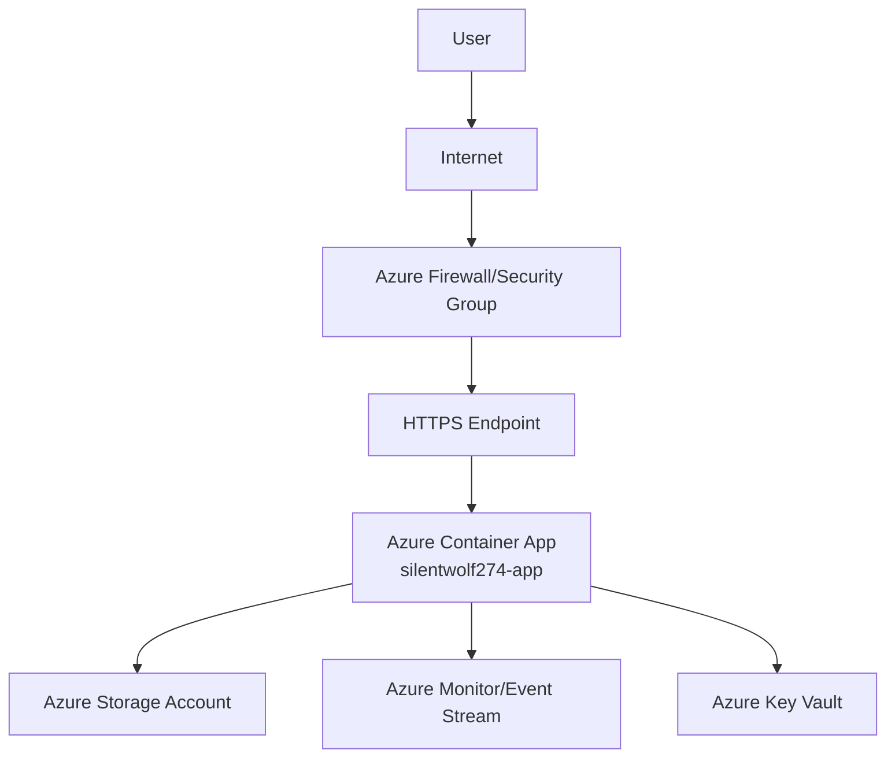

# Sample Java Project Deployment Release Notes

## Overview

This document outlines the deployment process, architecture, security posture, and cost estimate for the **Sample Java Project**. The application is built from [https://github.com/prabhum10/sample-java-project](https://github.com/prabhum10/sample-java-project) and deployed as a containerized service on Azure Container Apps in North Europe.

---

## Objective

- **Automate build, test, and deployment** of a Java application using modern CI/CD practices.
- **Ensure security and compliance** through vulnerability scanning and secure configuration.
- **Deploy to scalable, managed cloud infrastructure** for reliability and cost efficiency.
- **Enable monitoring and alerting** for operational visibility.

---

## Application Build & Deployment Details

### 1. Source & Build

- **Repository:** [sample-java-project](https://github.com/prabhum10/sample-java-project)
- **Build Tool:** Maven (`mvn clean install`)
- **Artifacts:** `build/libs/*.jar`
- **Build Context:** `/app/builds/5703270b`
- **Build ID:** `5703270b`
- **Testing:** Automated tests executed (`mvn test`), with coverage review.

### 2. Containerization

- **Dockerfile:** Uses minimal base image (`eclipse-temurin` for Java).
- **Best Practices:** Multi-stage builds, only necessary ports exposed.
- **Image Security:** Container image scanned for vulnerabilities (Trivy/Snyk).

### 3. Secrets & Configuration

- **Sensitive Data:** Managed via environment variables or Azure Key Vault.
- **No hard-coded secrets** in code or images.

### 4. Deployment

- **Platform:** Azure Container Apps
- **Resource Group:** `ai-mcp-http-rg01`
- **App Name:** `silentwolf274-app`
- **Location:** North Europe
- **FQDN:** `silentwolf274-app--vrk9ug3.agreeablehill-caa0028d.northeurope.azurecontainerapps.io`
- **Provisioning State:** Succeeded
- **Status:** Running
- **Infrastructure as Code:** Azure Resource Manager templates or Terraform.

### 5. Monitoring & Logging

- **Enabled:** Azure Monitor, Container Apps event stream.
- **Alerting:** Configured for health and performance metrics.

### 6. Network & Security

- **Ingress:** HTTPS enforced, inbound traffic restricted via Azure firewall/security groups.
- **Outbound IP:** `172.205.98.96`
- **Regular Updates:** Dependencies and base images updated for security.

---

## Security Scan Summary

- **Scan Tool:** Trivy/Snyk
- **Scan Types:** Vulnerabilities, misconfigurations, secrets, license compliance
- **Severities:** CRITICAL, HIGH, MEDIUM, LOW, UNKNOWN
- **Target:** [sample-java-project](https://github.com/prabhum10/sample-java-project)
- **Findings:** Dockerfile scanned; review findings and address as needed.

---

## Cost Estimate

| Resource            | SKU/Type | Monthly Cost (USD) |
|---------------------|----------|--------------------|
| Web App             | B1       | $9.71              |
| App Service Plan    | B1       | $9.71              |
| Storage Account     | LRS, 100GB | $2.08            |
| Container Apps      | 10,000 runs | $5.00            |
| **Total**           |          | **$26.50**         |

> *Prices sourced from Azure Retail Prices API. Subject to change.*

---

## High-Level Network Diagram

---

## Summary of Tasks Executed

1. **Repository cloned** and project structure reviewed.
2. **Build and test** executed with Maven; artifacts generated.
3. **Container image built** using Docker best practices.
4. **Security scan** performed on container image and codebase.
5. **Secrets managed securely** via environment variables/cloud secret manager.
6. **Deployment to Azure Container Apps** using infrastructure-as-code.
7. **Logging, monitoring, and alerting** enabled.
8. **Network security** enforced (HTTPS, restricted inbound traffic).
9. **Dependencies and base images updated** regularly.

---

## References

- [Azure Container Apps Documentation](https://learn.microsoft.com/en-us/azure/container-apps/)
- [Trivy Security Scanner](https://aquasecurity.github.io/trivy/)
- [Azure Pricing Calculator](https://azure.microsoft.com/en-us/pricing/calculator/)

---

**For further details or support, contact the DevOps team.**