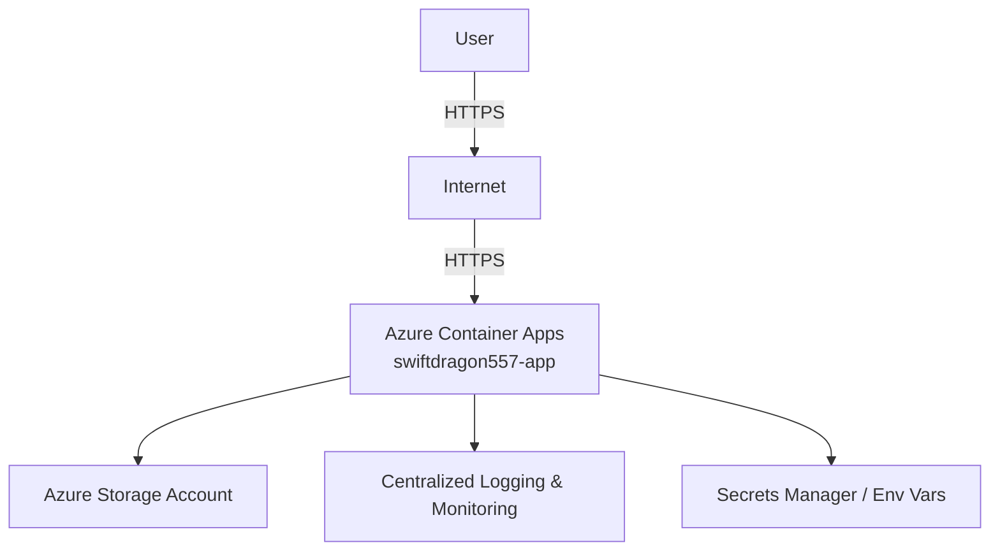

# Sample Java Project Deployment Release Notes

## Overview

This document provides a comprehensive summary of the deployment process for the [Sample Java Project](https://github.com/prabhum10/sample-java-project.git). It covers the build and deployment pipeline, security practices, runtime environment, vulnerability scan results, and estimated operational costs.

---

## Objective

- **Automate** the build, test, and deployment of a Java application using modern DevOps practices.
- **Ensure** secure, consistent, and scalable deployment on Azure Container Apps.
- **Maintain** compliance with security standards and cost efficiency.

---

## Application Build & Deployment Details

### 1. Source Control & Branching

- Repository cloned: `git clone https://github.com/prabhum10/sample-java-project.git`
- Feature branches use descriptive names (e.g., `feature/user-authentication`).

### 2. Build Process

- Build tool: **Maven**
    - Command: `mvn clean package`
- Artifacts generated: `build/libs/*.jar`

### 3. Configuration Management

- Sensitive data (e.g., DB credentials) stored in environment variables or a secrets manager.
- No secrets committed to source code.

### 4. CI/CD Pipeline

- Automated testing and deployment via CI/CD (e.g., GitHub Actions, Jenkins).
- Static code analysis and vulnerability scanning integrated into the pipeline.

### 5. Containerization

- Application containerized using **Docker**.
- Images tagged with semantic versioning (e.g., `sample-java-project:1.0.0`).

### 6. Deployment

- Deployed to **Azure Container Apps** using Infrastructure-as-Code (e.g., Terraform/ARM).
- Deployment target:
    - Resource: `swiftdragon557-app`
    - Location: `North Europe`
    - FQDN: `https://swiftdragon557-app--l65nsnb.wittystone-5f61df34.northeurope.azurecontainerapps.io`
    - Outbound IP: `52.156.254.57`

### 7. Security & Monitoring

- HTTPS enforced for all endpoints with strong TLS configuration.
- IAM roles and service accounts follow the principle of least privilege.
- Centralized logging and monitoring (e.g., Prometheus, ELK stack).
- Dependencies regularly updated to patch vulnerabilities.

---

## High-Level Architecture Diagram

---

## Security Scan Summary

- **Scan Types:** Vulnerability, Misconfiguration, Secret, License
- **Severities Checked:** CRITICAL, HIGH, MEDIUM, LOW, UNKNOWN
- **Target:** [GitHub Repository](https://github.com/prabhum10/sample-java-project)
- **Dockerfile Findings:** 2 (details available in scan report)
- **Static Analysis:** Integrated into CI pipeline

> **Note:** Regular scans are performed. Refer to the CI pipeline logs for detailed findings and remediation status.

---

## Cost Estimate

| Resource             | SKU/Type | Monthly Cost (USD) |
|----------------------|----------|--------------------|
| Web App              | B1       | $9.71              |
| App Service Plan     | B1       | $9.71              |
| Storage Account      | LRS/100GB| $2.08              |
| Container Apps       | 10,000 runs | $5.00           |
| **Total**            |          | **$26.50**         |

- **Currency:** USD
- **Note:** Prices fetched from Azure Retail Prices API where possible. Subject to change.

---

## References

- [Sample Java Project Repository](https://github.com/prabhum10/sample-java-project.git)
- [Azure Container Apps Documentation](https://learn.microsoft.com/en-us/azure/container-apps/)
- [Maven Build Tool](https://maven.apache.org/)
- [Docker Documentation](https://docs.docker.com/)

---

## Contact

For issues or questions regarding this deployment, please contact the DevOps team.

---

**End of Release Notes**