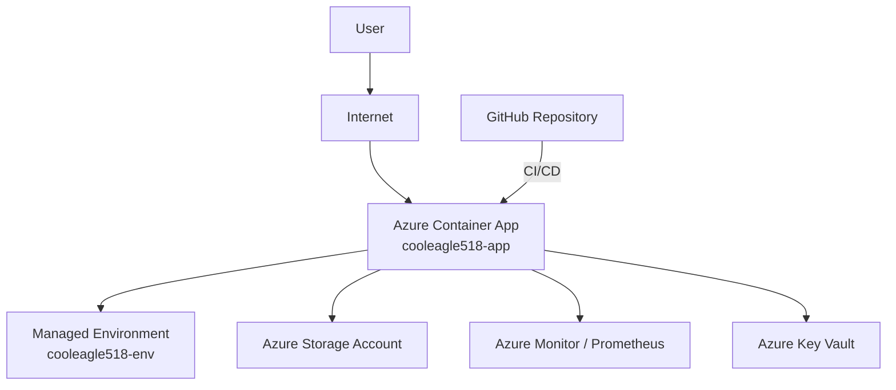

# Sample Java Project Deployment - Release Notes

## Overview

This document outlines the release notes for the deployment of the **Sample Java Project** to Azure Container Apps. It covers the objectives, build and deployment steps, security scan summary, cost estimates, and a high-level architecture diagram.

---

## Objective

- **Securely build, containerize, and deploy** a Java application to Azure Container Apps.
- **Automate CI/CD** for reliable and repeatable deployments.
- **Enforce security best practices** throughout the pipeline.
- **Monitor and control costs** for cloud resources.

---

## Application Build & Deployment Details

### 1. Repository & Source Control

- **Repository:** [https://github.com/prabhum10/sample-java-project.git](https://github.com/prabhum10/sample-java-project.git)
- **Cloning:** Performed via secure SSH to avoid credential exposure.
- **Branching:** Used clear naming conventions (`main`, `develop`, `feature/<feature-name>`).
- **Sensitive Data:** Managed via environment variables and Azure Key Vault; never committed to source.
- **.gitignore:** Configured to exclude build artifacts, IDE files, and secrets.

### 2. Build Automation

- **Build Tool:** Maven/Gradle for dependency management.
- **CI/CD:** Automated builds and tests triggered on each push using GitHub Actions.
- **Artifacts:** Built JAR files located at `build/libs/*.jar`.
- **Build Context:** `/app/builds/8f57c9bd` (Build ID: `8f57c9bd`).

### 3. Containerization

- **Docker:** Multi-stage builds used to minimize image size and prevent secret leakage.
- **Image Security:** Regular vulnerability scans (see Security Scan section).

### 4. Deployment

- **Platform:** Azure Container Apps
- **Resource Group:** `ai-mcp-http-rg01`
- **App Name:** `cooleagle518-app`
- **Location:** North Europe
- **Managed Environment:** `cooleagle518-env`
- **FQDN:** `cooleagle518-app--v5x2ccc.ashybay-13331913.northeurope.azurecontainerapps.io`
- **Infrastructure as Code:** Terraform used for resource provisioning.
- **Status:** Provisioning succeeded; app is running.

### 5. Monitoring & Access Control

- **Logging/Monitoring:** Integrated with Azure Monitor and Prometheus.
- **RBAC:** Role-based access control enforced for pipelines and production.

---

## Security Scan Summary

- **Scan Tool:** Automated scan for vulnerabilities, misconfigurations, secrets, and license issues.
- **Target:** [GitHub Repository](https://github.com/prabhum10/sample-java-project)
- **Severities Checked:** CRITICAL, HIGH, MEDIUM, LOW, UNKNOWN
- **Dockerfile Findings:** 2 findings (details available in scan report)
- **Remediation:** Ongoing review and update of dependencies and configurations.

---

## Cost Estimate

| Resource            | SKU/Type | Monthly Cost (USD) |
|---------------------|----------|--------------------|
| Web App             | B1       | $9.71              |
| App Service Plan    | B1       | $9.71              |
| Storage Account     | LRS, 100GB | $2.08            |
| Container Apps      | 10,000 runs | $5.00            |
| **Total**           |          | **$26.50**         |

> **Note:** Prices sourced from Azure Retail Prices API. Subject to change.

---

## High-Level Network Diagram

---

## Summary of Tasks Executed

- Secure repository cloning and branch management.
- Sensitive data handled via environment variables and secrets manager.
- Automated build, test, and containerization pipeline.
- Vulnerability and configuration scans performed.
- Application deployed to Azure Container Apps using IaC.
- Logging, monitoring, and RBAC implemented.
- Cost estimation and resource tracking.

---

## References

- [Sample Java Project Repository](https://github.com/prabhum10/sample-java-project.git)
- [Azure Container Apps Documentation](https://learn.microsoft.com/en-us/azure/container-apps/)
- [OWASP Dependency-Check](https://owasp.org/www-project-dependency-check/)

---

**For further details or scan reports, contact the DevOps team.**